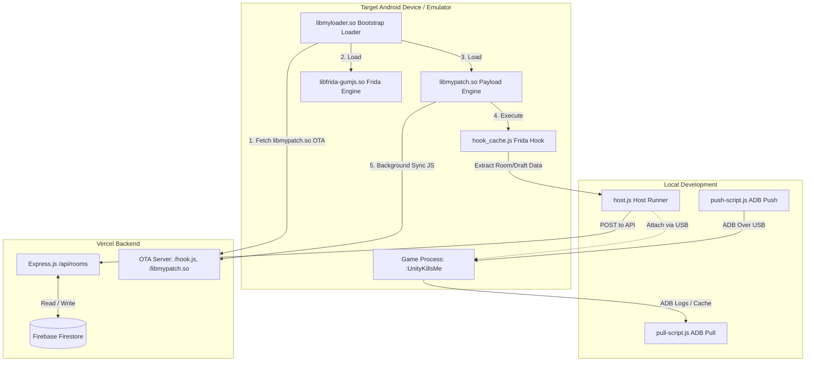

# MLBSv4 Project Documentation: Build & Development Guide

This document contains a comprehensive guide to understanding, building, and developing the **MLBSv4** project. The project is an advanced mobile tournament integration tool that dynamically intercepts game state data at runtime, handles secure Over-The-Air (OTA) updates, and aggregates data to a centralized Firestore-backed backend.

---

## 1. Project Overview & Architecture

The architecture consists of three primary layers cooperating over network boundaries:
1. **Backend / Vercel Node.js API**
2. **Android Client Native Core (Loader & Payload Engine)**
3. **Frida JS Hook Agent**

### Component Interaction Diagram



### Key Architectural Concepts

*   **Engine-Split Design:** To optimize OTA bandwidth and speed, the heavy Frida-GumJS runtime (`libfrida-gumjs.so`) is compiled into its own shared library. The loader (`libmyloader.so`) pre-loads this engine globally, keeping the OTA payload payload (`libmypatch.so`) extremely lightweight.
*   **OTA Security Model (RSA-2048):** To prevent execution of unauthorized binaries or hook scripts, all OTA packages (`libmypatch.so` and `hook.js`) are signed with an RSA private key. The native Android loader and payload engine verify signatures against a built-in public key (`rsa_public_key`) using SHA256 before loading the updates on boot.
*   **Robust Fallback Handling:** If the network is unavailable or verification fails during boot, the loader safely falls back to the embedded libraries and JS scripts compiled directly inside the APK's `assets/` directory.

---

## 2. Code Structure

Here are the main components and directories in this repository:

*   [package.json](file:///home/petwirkepo/mlbsv4/package.json): Defines npm package scripts and dependencies.
*   [host.js](file:///home/petwirkepo/mlbsv4/host.js): Main Node.js command-line interface that connects to an Android device over USB, attaches to the target game process (`:UnityKillsMe`), injects the compiled hook script, and forwards incoming events to the REST API.
*   [src/index.js](file:///home/petwirkepo/mlbsv4/src/index.js): The Frida instrumentation script. It utilizes [frida-il2cpp-bridge](https://github.com/vfsfitvnm/frida-il2cpp-bridge) to resolve types/structures in memory at runtime and extract active draft/room details.
*   [native-patcher/](file:///home/petwirkepo/mlbsv4/native-patcher): Contains the Android NDK C++ codebase.
    *   [native-patcher/jni/loader.cpp](file:///home/petwirkepo/mlbsv4/native-patcher/jni/loader.cpp): Bootstrap loader library (`libmyloader.so`).
    *   [native-patcher/jni/main.cpp](file:///home/petwirkepo/mlbsv4/native-patcher/jni/main.cpp): Frida injection and OTA manager engine (`libmypatch.so`).
    *   [native-patcher/build.sh](file:///home/petwirkepo/mlbsv4/native-patcher/build.sh): Local cross-compilation shell script for native libs.
*   [api/index.js](file:///home/petwirkepo/mlbsv4/api/index.js): Express.js REST API deployed as serverless functions on Vercel. Connects to Firestore to manage active tournament rooms.
*   [scripts/](file:///home/petwirkepo/mlbsv4/scripts): Helper scripts used during development and builds:
    *   [generate-keys.js](file:///home/petwirkepo/mlbsv4/scripts/generate-keys.js): Generates keypairs and injects public keys into native source files.
    *   [sign-ota.js](file:///home/petwirkepo/mlbsv4/scripts/sign-ota.js): Bundles and signs the Frida JS agent for OTA delivery.
    *   [sign-lib.js](file:///home/petwirkepo/mlbsv4/scripts/sign-lib.js): Signs compiled native `.so` libraries for OTA.
    *   [push-script.js](file:///home/petwirkepo/mlbsv4/scripts/push-script.js): Transports compiled scripts/signatures straight into an ADB-connected test device and restarts the app.
    *   [pull-script.js](file:///home/petwirkepo/mlbsv4/scripts/pull-script.js): Fetches logs and active caches from test devices.

---

## 3. Environment & Prerequisites

To set up a local workspace, you need:

1.  **Node.js (v20+)** and npm installed.
2.  **Python 3** (used by [encrypt.py](file:///home/petwirkepo/mlbsv4/native-patcher/encrypt.py) to build fallback binary buffers).
3.  **Android NDK (r26d or newer)** to compile the C++ source files.
4.  **Android SDK / ADB Platform Tools** configured in your environment variable PATH.
5.  An Android device or emulator with:
    *   Developer Options enabled.
    *   USB Debugging activated.
    *   Target package installed: `com.mobilelegends.taptest` (or whatever package matches the configured `PACKAGE_NAME`).

---

## 4. Initial Setup & Key Generation

The security model relies on private/public key pairs. **You must generate keys before compiling the native patcher.**

Run the following command to generate the key pair:
```bash
npm run gen-keys
```

> [!CAUTION]
> Regenerating keys (`npm run gen-keys -- --force`) will invalidate signature verification for any existing APKs built with the old public key. Do this only if you intend to recompile and reinstall the APK on all devices.

### What `gen-keys` does:
1. Generates a new 2048-bit RSA keypair in `keys/private_key.pem` and `keys/public_key.der`.
2. Converts the DER public key into a C-style byte array.
3. Automatically replaces the contents of `rsa_public_key` in [native-patcher/jni/main.cpp](file:///home/petwirkepo/mlbsv4/native-patcher/jni/main.cpp) and [native-patcher/jni/loader.cpp](file:///home/petwirkepo/mlbsv4/native-patcher/jni/loader.cpp).

---

## 5. Compilation & Building

Building involves two core pipelines: compilation of the JS hook, and compilation of the native Android libraries.

### A. Build JS Hook
Compiles `src/index.js` using `frida-compile` into the distribution folder `dist/agent.js`:
```bash
npm run build
```

### B. Build Native Libraries (`ndk-build`)
Make sure Android NDK is added to your environment `PATH` (e.g., `export PATH=$PATH:/path/to/android-ndk`). Then compile by running the build script:
```bash
cd native-patcher
./build.sh --all
```

> [!WARNING]
> If your system has a global NDK setup that overrides `ndk-build` via exported environment variables (e.g. `ANDROID_NDK`, `ANDROID_NDK_ROOT`, or `ANDROID_NDK_HOME` pointing to a different folder like `/opt/android-ndk`), it can lead to compilation or linker errors (such as missing standard library ABI symbols like `__ndk1` or `[abi:nn210000]`).
> To avoid this, explicitly override the variables to point to the local NDK:
> ```bash
> export ANDROID_NDK="/home/petwirkepo/mlbsv4/android-ndk-r26d"
> export ANDROID_NDK_ROOT="/home/petwirkepo/mlbsv4/android-ndk-r26d"
> export ANDROID_NDK_HOME="/home/petwirkepo/mlbsv4/android-ndk-r26d"
> export PATH="/home/petwirkepo/mlbsv4/android-ndk-r26d:$PATH"
> ./build.sh --all
> ```

#### Available options for `build.sh`:
*   `--all`: Builds everything (encrypter fallback header, `libmyloader.so`, and `libmypatch.so`) [Default].
*   `--js-only`: Only encrypts the JavaScript hook into `jni/hook_bytes.h`.
*   `--loader-only`: Only compiles `libmyloader.so`.
*   `--patch-only`: Only compiles `libmypatch.so`.
*   `--clean`: Deletes intermediate object folders (`obj/`, `libs/`).

### C. Signing Build Outputs
After compiling both JS and native targets, they must be signed so they are accepted by the OTA system:

1.  **Sign JavaScript OTA Hooks:**
    ```bash
    npm run sign-ota
    ```
    This signs `dist/agent.js`, creates `public/hook.js` and `public/hook.js.sig`, and updates the native code fallback hook header.

2.  **Sign Native Binary Libraries:**
    ```bash
    npm run sign-lib
    ```
    This signs the compiled `libmypatch.so` for each architecture (e.g., `arm64-v8a`, `armeabi-v7a`), creating signature `.sig` files in `public/` and copies them to the native-patcher assets folder.

---

## 6. Local Development & Debugging Workflow

Here is how to run and test changes during development:

### Real-Time Compilation
To watch and rebuild Frida JS files automatically when they change:
```bash
npm run watch
```

### Live Testing with USB Device
To test the script live on an ADB-connected device:
1. Connect your Android device via USB.
2. Ensure the game is running or ready.
3. Start the host controller:
   ```bash
   npm run start-host
   ```
   This script will wait for the target game process to boot, attach to it, inject `dist/agent.js`, and start printing logs and forwarding room data to your local/production API.

### ADB Utility Scripts (Device Syncing)
To push your newly signed scripts directly to the device cache without waiting for OTA download loops, run:
```bash
npm run push-script
```
*This will push the signed hook script to `/sdcard/Android/data/<package-name>/files/hook_cache.js` and restart the application.*

To pull active logs, current cache, and configurations back to your machine for examination:
```bash
npm run pull-script
```
*Files will be retrieved and saved into `dist/pulled/`.*

### Testing Backend REST API
To verify the REST API CRUD routes and token authentication works properly:
```bash
node test-api.js
```

---

## 7. CI/CD Deployment Pipeline

This repository is pre-configured with a GitHub Actions workflow in [.github/workflows/build-and-deploy.yml](file:///home/petwirkepo/mlbsv4/.github/workflows/build-and-deploy.yml).

### Pipeline Execution Flow
On every push/PR to the `main` branch, the pipeline will:
1. Set up Node.js and dependencies.
2. Configure Android NDK.
3. Reconstruct signing keys in memory from GitHub secrets.
4. Compile JS hooks and NDK libraries.
5. Create cryptographically signed OTA bundles.
6. Automatically deploy the Express.js API and public assets to production via Vercel.

### Required Actions Secrets
For the pipeline to succeed, make sure to add these secrets in your GitHub repository setting:
*   `PRIVATE_KEY`: Content of `keys/private_key.pem`.
*   `PUBLIC_KEY`: Content of `keys/public_key.der`.
*   `FIREBASE_SERVICE_ACCOUNT`: Service account JSON credential.
*   `VERCEL_ORG_ID`: Vercel organization ID.
*   `VERCEL_PROJECT_ID`: Vercel project ID.
*   `VERCEL_TOKEN`: Vercel deployment token.
