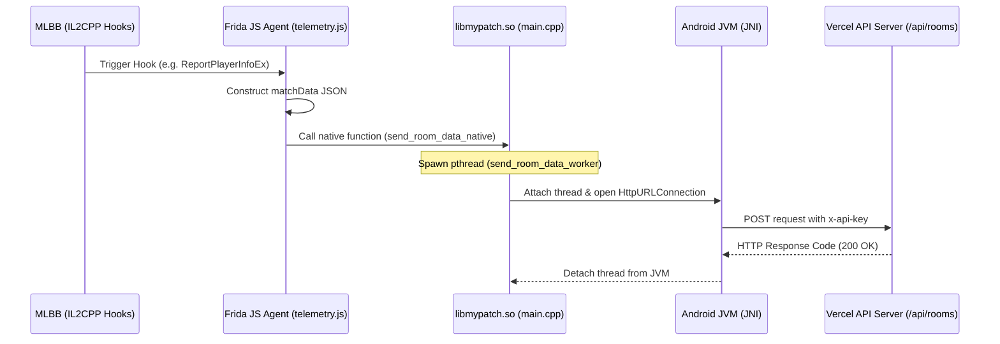

# Standalone Telemetry Architecture with NativePatcher (MLBB Mod)

This document provides technical documentation on how telemetry data (`matchData` / room data) is successfully sent from the game client to the API server when running inside a standalone patched APK (using NativePatcher) without relying on a USB cable connection or a PC host script.

---

## 1. Problem Statement: Why did `Java.perform()` fail?

In the live USB debugging setup:
* The Frida host script (`host.js`) runs on the PC and injects `agent.js` into the game.
* The JS environment has access to the full Frida runtime, including the `Java` bridge.

In the standalone NativePatcher setup:
* The Frida script is embedded directly into the game APK using `libmypatch.so` and `libfrida-gumjs.so`.
* To keep the library compact, the embedded JavaScript engine (GumJS) is compiled **without the Frida Java bridge (`frida-java-bridge`)**.
* Therefore, calling `Java.perform()` or referencing the global `Java` object in JavaScript fails with the error:
  `[REST API] Java not available`

---

## 2. Solution: Native C++ JNI Forwarding

To bypass the lack of the Frida Java bridge in GumJS, we moved the networking logic into the native C++ layer (`libmypatch.so`), which has direct access to the Java Virtual Machine (JVM) through the Java Native Interface (JNI).

The architecture consists of two layers:
1. **JavaScript Telemetry Layer (`src/telemetry.js`)**
2. **C++ Native Layer (`native-patcher/jni/main.cpp`)**

### Data Flow Diagram


---

## 3. Implementation Details

### A. JavaScript Telemetry Layer
In [src/telemetry.js](file:///home/petwirkepo/mlbsv4/src/telemetry.js#L8-L40), the function `sendToRestApi(payload)` dynamically searches the loaded modules for the native export `send_room_data_native`:

```javascript
export function sendToRestApi(payload) {
  try {
    let send_room_data_native_ptr = null;
    const modules = Process.enumerateModules();
    for (let i = 0; i < modules.length; i++) {
      const mod = modules[i];
      if (mod.name.indexOf("mypatch") !== -1) {
        send_room_data_native_ptr = mod.findExportByName("send_room_data_native");
        if (send_room_data_native_ptr) break;
      }
    }
    if (!send_room_data_native_ptr) {
      send_room_data_native_ptr = Module.findExportByName(null, "send_room_data_native");
    }

    if (send_room_data_native_ptr && !send_room_data_native_ptr.isNull()) {
      const sendRoomDataNative = new NativeFunction(send_room_data_native_ptr, 'void', ['pointer']);
      const jsonBody = JSON.stringify(payload);
      const payloadPtr = Memory.allocUtf8String(jsonBody);
      sendRoomDataNative(payloadPtr);
      debugLog("REST API", "Data forwarded to native send_room_data_native");
      return;
    }
  } catch (err) {
    debugLog("REST API", `Error trying native forwarder: ${err.message}`);
  }

  // Fallback to Java.perform() if running in Live USB mode with Java bridge available
  ...
}
```

### B. C++ Native Layer
In [native-patcher/jni/main.cpp](file:///home/petwirkepo/mlbsv4/native-patcher/jni/main.cpp), we export the JNI helper:

```cpp
static std::string g_room_data_payload = "";

void* send_room_data_worker(void* arg) {
    if (!g_vm) return NULL;
    JNIEnv *env = NULL;
    jint res = g_vm->GetEnv((void**)&env, JNI_VERSION_1_6);
    bool attached = false;
    if (res == JNI_EDETACHED) {
        if (g_vm->AttachCurrentThread(&env, NULL) != 0) {
            LOGE("Failed to attach thread for room data sending");
            return NULL;
        }
        attached = true;
    }
    
    if (env) {
        std::string base_url = "https://mlbsv4.vercel.app";
        // Construct HttpURLConnection, set headers, and write payload JSON...
        ...
        jmethodID get_response_code = env->GetMethodID(conn_class, "getResponseCode", "()I");
        jint code = env->CallIntMethod(conn_obj, get_response_code);
        LOGI("Room data send response code: %d", code);
    }
    if (attached) {
        g_vm->DetachCurrentThread();
    }
    return NULL;
}

extern "C" __attribute__((visibility("default"))) void send_room_data_native(const char *json_payload) {
    if (!json_payload) return;
    g_room_data_payload = json_payload;
    pthread_t thread;
    pthread_create(&thread, NULL, send_room_data_worker, NULL);
    pthread_detach(thread);
}
```

---

## 4. How to Compile and Deploy

1. **Compile & Package Everything**:
   Run the following script in the root directory to recompile the JS agent, update the fallback embedded JS arrays, compile the native library (`libmypatch.so`), and sign it:
   ```bash
   npm run build-all
   ```

2. **Integration into APK**:
   Copy the compiled native libraries from `native-patcher/libs/` to your APK's `lib/` directory under their respective architectures:
   * **ARM64 (64-bit)**: `native-patcher/libs/arm64-v8a/libmypatch.so`
   * **ARMv7 (32-bit)**: `native-patcher/libs/armeabi-v7a/libmypatch.so`

3. **Deploy Web Server Updates (OTA Fallback)**:
   Ensure you redeploy your web server on Vercel so that the OTA JS updates (`public/hook.js` and `public/hook.js.sig`) match the signature keys.

---

## 5. Verification: How to Check Logs
You can monitor the network request state on the Android device via ADB:
```bash
adb logcat -v time | grep -E "FridaJS|NativePatcher"
```

**Expected Log Output on Success:**
```text
I/FridaJS (16137): [REST API] Data forwarded to native send_room_data_native
I/NativePatcher(16137): Room data send response code: 200
```
